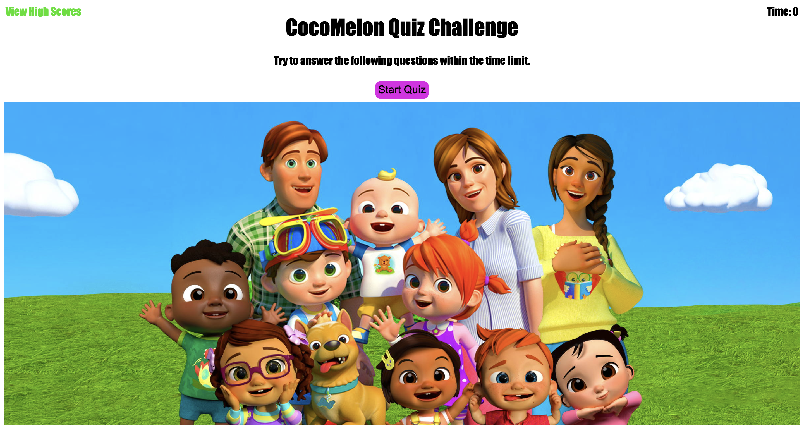

# Quiz
  ## Table of Contents
* [Description](#description)
* [Installation](#installation)
* [Usage](#usage)
* [License](#license)
* [Contributors](#contributors)
* [Questions](#questions)
* [Website](#website)
## Description
This is a quiz about CoCoMelon made through Java and APIs
## Install
No install needed.
## Usage
Pass the Quiz!
## Contributors
Katherine Gendaszek
## Questions
If you have any questions about the application contact me directly at katieshake27@gmail.com
## Contact
katieshake27@gmail.com

## Website

https://kgendaszek.github.io/code-quiz/

Check out my other work on GitHub.
https://github.com/kgendaszek